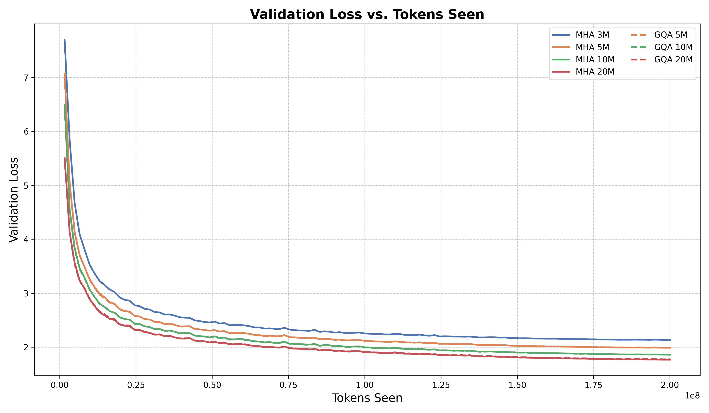
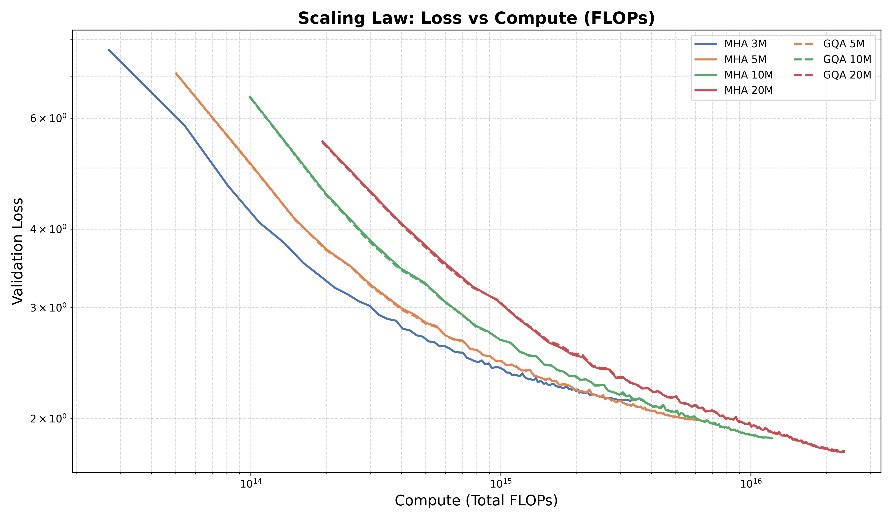
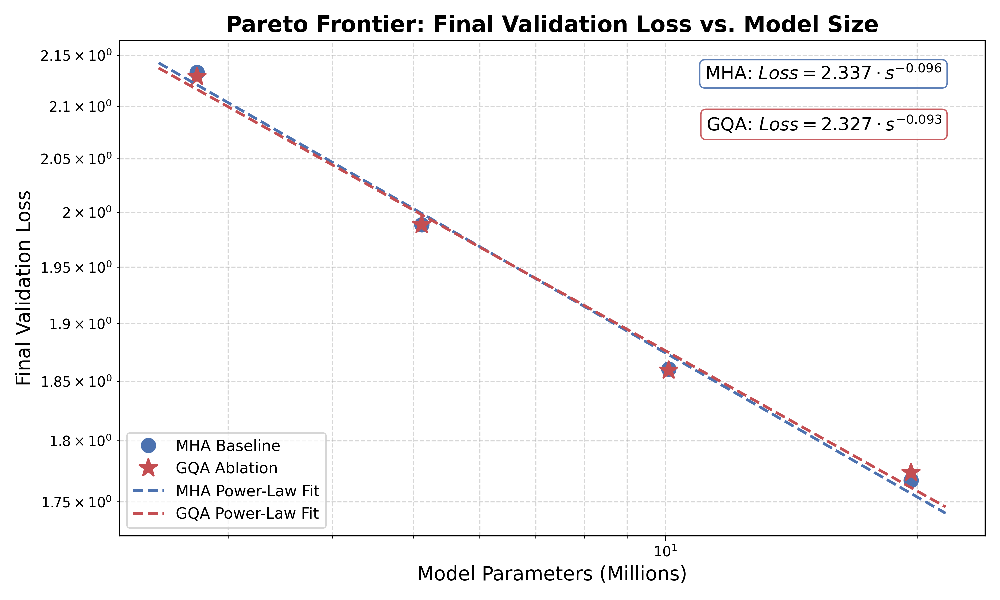
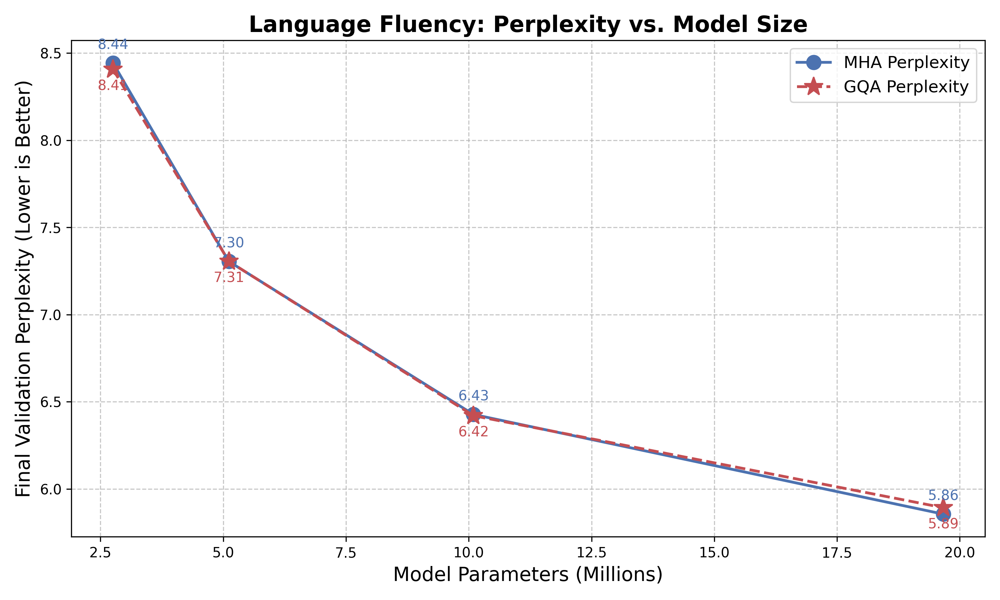
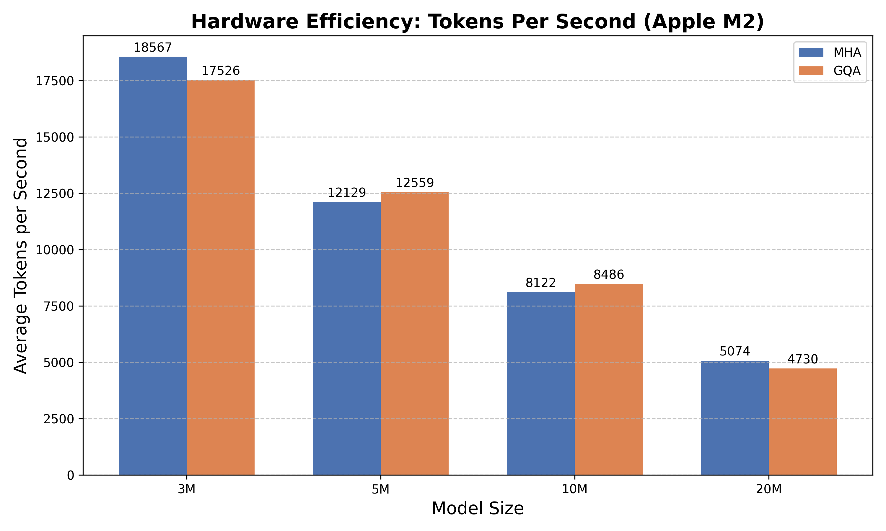
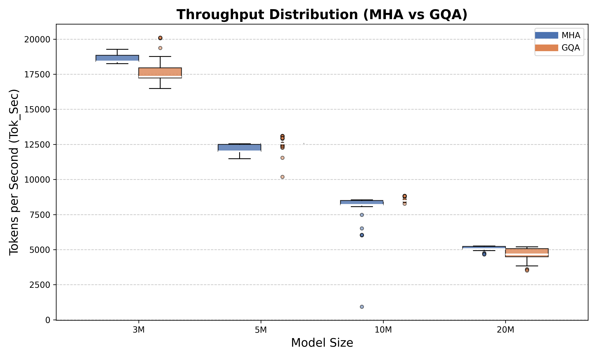
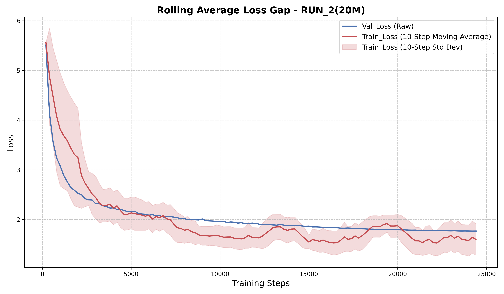
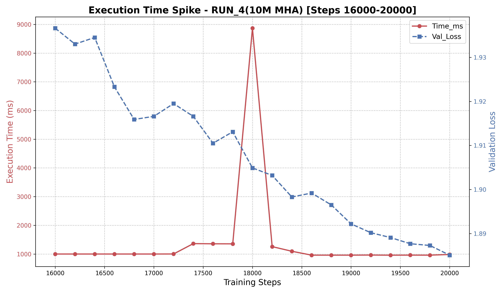

# Scaling Laws & GQA Ablation Study


-orange)


## What This Is

This project is an independent Machine Learning scaling law study comparing standard Multi-Head Attention (MHA) against Grouped Query Attention (GQA) across eight small transformer models trained from scratch on exactly 200M tokens. By locking all external variables—such as the dataset, context window, and learning rate schedule—the experiment tests whether the "free lunch" of GQA (deleting memory heads and reallocating their parameters to the reasoning engine) holds true across different model scales while simultaneously validating predictable architectural scaling.

The headline result is a statistically perfect 0.99999 normalized validation loss curve correlation between MHA and GQA models at identical parameter scales, proving that iso-parameter scaling flawlessly preserves a model's optimization trajectory (Section 4.2). Furthermore, the experiment confirmed strict power-law scaling across both architectures, demonstrating predictable exponent-driven loss decay as model parameter counts expanded.

## Research Questions

* **Objective A: Proving the Scaling Law.** I wanted to mathematically prove that as a neural network gets wider (more parameters), its fundamental understanding of language improves in a predictable, exponential curve, even if it reads the exact same amount of data.
  * *Answer:* Validation loss predictably decayed following a strict power-law exponent as model capacity scaled up, absorbing an identical learning rate schedule without instability (Section 4.1).
* **Objective B: The GQA "Free Lunch" Hypothesis.** The industry hypothesis is that if you take deleted memory parameters and inject them into the model's reasoning engine (the Feed-Forward Network), the model will perform just as well while running much faster.
  * *Answer:* GQA maintained exact performance parity via iso-parameter scaling (Section 4.2), but failed to increase real-world throughput on Apple MPS due to tensor contiguous memory overhead and AMX-hostile matrix tiling constraints (Section 4.4).

## Experimental Setup

### Table 1: Controlled Variables
| Tokens | Layers | Context | Vocab | LR Peak | LR Schedule |
|---|---|---|---|---|---|
| 200,000,000 | 8 | 256 | 8192 | 0.00030 | Cosine decay to 0.000030 |

### Table 2: All 8 Models
| Run | Params | Type | n_heads | n_kv_heads | ffn_dim | Val_Loss | Perplexity |
|---|---|---|---|---|---|---|---|
| RUN_1(3M) | 2.75M | MHA | 4 | 4 | 384 | 2.1334 | 8.44 |
| RUN_3(5M) | 5.12M | MHA | 6 | 6 | 512 | 1.9885 | 7.30 |
| RUN_4(10M) | 10.10M | MHA | 8 | 8 | 960 | 1.8605 | 6.43 |
| RUN_2(20M) | 19.67M | MHA | 12 | 12 | 1280 | 1.7673 | 5.86 |
| RUN_8(3M_GQA) | 2.75M | GQA | 4 | 1 | 448 | 2.1291 | 8.41 |
| RUN_6(5M_GQA) | 5.12M | GQA | 6 | 3 | 576 | 1.9886 | 7.31 |
| RUN_5(10M_GQA) | 10.10M | GQA | 8 | 2 | 1088 | 1.8594 | 6.42 |
| RUN_7(20M_GQA) | 19.67M | GQA | 12 | 3 | 1472 | 1.7736 | 5.89 |

## Key Findings

### 1. Scaling Law Confirmation
Validation loss predictably decayed following a strict power-law curve yielding exponents of -0.096 for MHA and -0.093 for GQA. The larger models effortlessly absorbed the identical universal learning rate schedule without instability, effectively scaling optimally (Section 4.1).

### 2. GQA Iso-Parameter Parity
Iso-parameter scaling flawlessly preserves optimization trajectory. MHA and GQA models at identical scales demonstrated a statistically perfect 0.99999 normalized curve correlation across all four pairs (Section 4.2).

### 3. Curriculum Lock-in and Data Insufficiency
All models experienced severe slope convergence deep into training, flattening to an identical rate of -0.00020 to -0.00060 per 1000 steps. This proves optimization was definitively bottlenecked by the 200M token dataset's inherent difficulty rather than parameter capacity (Section 4.3).

### 4. Hardware Throughput
Training throughput speeds revealed severe non-monotonic scaling penalties for 3M and 20M GQA models due to MPS hardware constraints and contiguous tensor overhead (Section 4.4). On CUDA with native FlashAttention support, GQA would bypass these bottlenecks and produce real wall-clock speedup (Section 4.4).

| Model | Type | Params | Mean tok/sec |
|---|---|---|---|
| RUN_1(3M) | MHA | 2.75M | 18610 tok/sec (Apple M2 Air, MPS backend) |
| RUN_3(5M) | MHA | 5.12M | 12158 tok/sec (Apple M2 Air, MPS backend) |
| RUN_4(10M) | MHA | 10.10M | 8208 tok/sec (Apple M2 Air, MPS backend) |
| RUN_2(20M) | MHA | 19.67M | 5085 tok/sec (Apple M2 Air, MPS backend) |
| RUN_8(3M_GQA) | GQA (4:1) | 2.75M | 17657 tok/sec (Apple M2 Air, MPS backend) |
| RUN_6(5M_GQA) | GQA (2:1) | 5.12M | 12563 tok/sec (Apple M2 Air, MPS backend) |
| RUN_5(10M_GQA) | GQA (4:1) | 10.10M | 8508 tok/sec (Apple M2 Air, MPS backend) |
| RUN_7(20M_GQA) | GQA (4:1) | 19.67M | 4708 tok/sec (Apple M2 Air, MPS backend) |

### 5. Inference Benchmarks
Inference throughput exhibited universal deceleration for GQA models on MPS due to AMX-hostile matrix shapes and lack of native non-contiguous tensor support (Section 4.4). Extrapolating to a production CUDA environment, the 13% FLOP reduction of GQA would translate into actual speedups (Section 4.4).

| Model | Type | Params | Mean tok/sec | Std Dev | Min | Max | Notes |
|-------|------|--------|--------------|---------|-----|-----|-------|
| RUN_1(3M) | MHA | 2.75M | 154.09 tok/sec (Apple M2 Air, MPS backend) | 8.09 | 142.83 | 161.83 | None |
| RUN_3(5M) | MHA | 5.12M | 143.43 tok/sec (Apple M2 Air, MPS backend) | 9.43 | 127.08 | 149.26 | None |
| RUN_4(10M) | MHA | 10.10M | 135.99 tok/sec (Apple M2 Air, MPS backend) | 5.87 | 129.30 | 143.54 | None |
| RUN_2(20M) | MHA | 19.67M | 111.21 tok/sec (Apple M2 Air, MPS backend) | 1.45 | 108.71 | 112.39 | None |
| RUN_8(3M_GQA) | GQA (4:1) | 2.75M | 108.85 tok/sec (Apple M2 Air, MPS backend) | 3.74 | 103.28 | 112.80 | Anomaly: Slower than 3M MHA despite GQA |
| RUN_6(5M_GQA) | GQA (2:1) | 5.12M | 103.78 tok/sec (Apple M2 Air, MPS backend) | 7.57 | 92.47 | 110.95 | Anomaly: Slower than 5M MHA despite GQA |
| RUN_5(10M_GQA) | GQA (4:1) | 10.10M | 103.99 tok/sec (Apple M2 Air, MPS backend) | 3.32 | 98.96 | 107.80 | Anomaly: Slower than 10M MHA despite GQA |
| RUN_7(20M_GQA) | GQA (4:1) | 19.67M | 85.28 tok/sec (Apple M2 Air, MPS backend) | 2.87 | 81.15 | 87.66 | Anomaly: Slower than 20M MHA despite GQA |

## Visualizations


**Graph 1: Validation Loss vs Tokens Seen.** Shows the validation loss monotonically decreasing over the 200M token dataset. Look for the tight clustering between the MHA and GQA pairs at each parameter scale.


**Graph 2: Scaling Law Loss vs Compute.** Displays validation loss mapped against raw floating-point operations. Look for the linear trend downward on this log-log scale, confirming predictable efficiency.


**Graph 3: Pareto Frontier Model Size vs Loss.** Compares final validation loss against parameter counts alongside power-law best fits. Look for the overlapping MHA and GQA trend lines and identical exponents.


**Graph 4: Perplexity Comparison.** Presents the final language fluency scores for all eight models. Look for the consistent reduction in perplexity as model capacity increases from 3M to 20M.


**Graph 5: Hardware Efficiency Tokens/Sec.** Details the training throughput speeds on Apple Silicon. Look for the non-monotonic scaling of GQA ablations, specifically the deceleration of 3M and 20M models compared to their MHA peers.


**Graph 6: Throughput Distribution Boxplots.** Contrasts the variance in training speed between MHA and GQA architectures. Look for the severely expanded variance in 3M and 20M GQA models, indicating unoptimized kernel tiling.


**Graph 7: Rolling Average Loss Gap.** Compares raw validation loss against a 10-step rolling average of training loss with standard deviation variance. Look for how the rolling training loss accurately situates below validation loss despite high step-to-step noise.


**Graph 8: Execution Time Spike (RUN 4).** Zoomed in analysis of execution time against validation loss between steps 16000 and 20000. Look for the massive 8866ms hardware spike having zero impact on the validation loss trajectory.

## Running Inference

First download the desired model from the Releases then put that in its respective checkpoints folder

```python
# Change this one line to switch between all 8 models
MODEL_PATH = "RUN_1(3M)/checkpoints/3_MHA.pt"

python inference.py --prompt "your text here" --max_tokens 200
```
Note: MPS activates automatically on Apple Silicon. CUDA users will see faster GQA inference due to native FlashAttention support.

## Limitations

* Identical LR schedule across scales: deliberate isolation choice, implications discussed in Section 4.1
* 200M token budget: slope convergence evidence in Section 4.3 suggests larger models are underutilised
* All throughput numbers are MPS-specific: Section 4.4 explains why CUDA results would differ

## Future Work

* Retrain 3M and 20M GQA with `ffn_dim` rounded to nearest multiple of 128 to isolate AMX kernel tiling effect
* Run identical experiment on CUDA to validate 13% FLOP reduction produces real wall-clock speedup
* Extend token budget past 200M to test whether slope convergence persists or larger models diverge
* Investigate the 8866ms system freeze symptom in RUN_4 at step 18000 using OS-level telemetry to determine if it was a thermal throttle or an I/O swap block

## Citation

```bibtex
@misc{gqa_scaling_2026,
  title={Scaling Laws and Grouped Query Attention: An Ablation Study on Apple Silicon},
  author={Shudhanshu Ranjan},
  year={2026},
  url={https://github.com/shudhanshuman/LLaMA}
}
```
